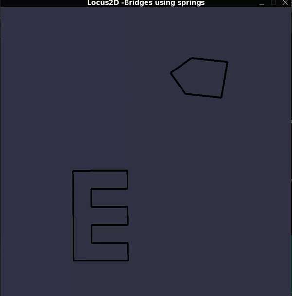
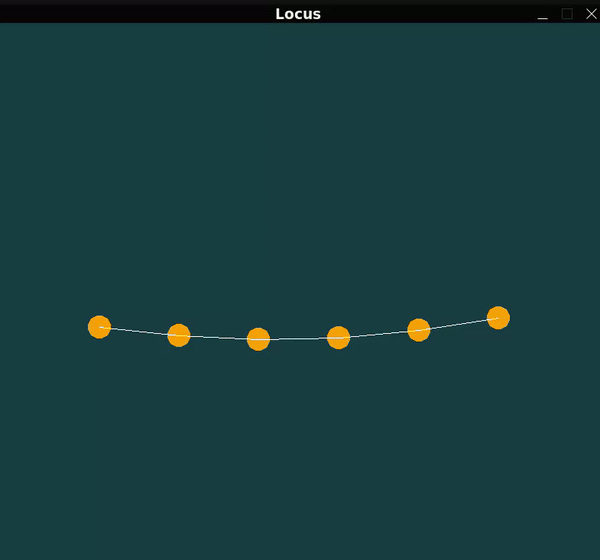

# **locus2D**

**locus2D** is a C++ physics engine using **Raylib** for rendering abstraction.

## Features

<table>
  <tr>
    <td>
       <b style="color:orange;">Soft body system</b>: 
       Ability to create soft bodies by defining particle positions and springs in between the particles. Implementation is inspired
      by Jelly car physics .
         
    </td>
    <td>
      
    </td>
  </tr>
  <tr>
    <td>
       <b style="color:orange;">Particle System</b>: 
      Configurable particle system with adjustable generation speed, particle age, and damping ratio. Check out the firework simulations.
    </td>
    <td>
      
    </td>
  </tr>
  <tr>
    <td>
      <b style="color:orange;">Spring and Harmonic Dampened Spring System</b>: 
      Configurable spring system for simulating behaviors such as camera follow, vehicle suspension, etc. Includes a bridge simulation with springs.
    </td>
    <td>
      
    </td>
  </tr>
</table>

- **Collision Detection**: Pending
- **Verlet Integration**: Pending

## Getting Started

**This project uses CMake as the build tool.**

1. **Clone the Repository:**

    ```bash
    git clone https://github.com/yourusername/locus2D.git
    ```

2. **Build the Project:**

    Navigate to the project directory and compile the engine:

    ```bash
    cd locus2D
    mkdir build
    cd build
    cmake ..
    make
    ```
